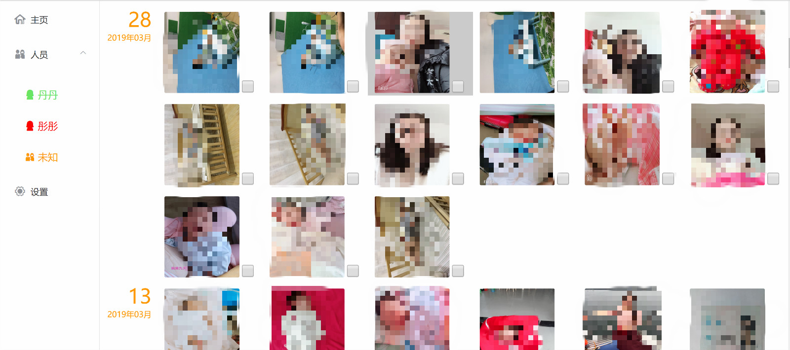
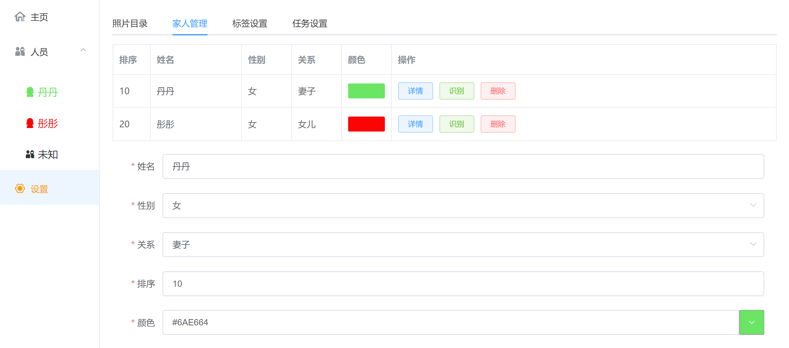

# 時光 TIME LINE
家庭图片整理软件,记录時光

## 图片浏览
人员分类浏览


软件设置


## 为什么做这个项目
自己的电脑上的图片越来越多，整理起来非常麻烦，而现有的软件没有定制需求。本程序可以对图片进行分类，同时可以进行人脸识别。所有图片自动获取`exif`信息，图片按照拍摄日期获取


## 环境
```
基础包: npm install --global windows-build-tools

人脸识别: 使用 face-api.js

nginx: 详情查看 server/docs/nginx.conf 
由于我的电脑图片都放在D盘，所以将D盘整体作为静态文件路径

```
## 启动
```
$ cd timeline/server && npm install && node bin/www

```
访问: `http://localhost:4000/tl-web`
